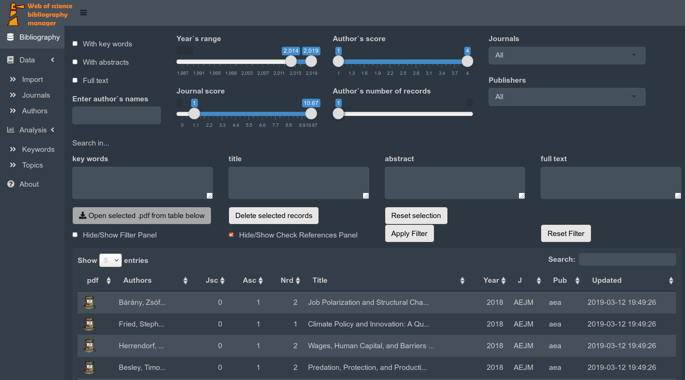
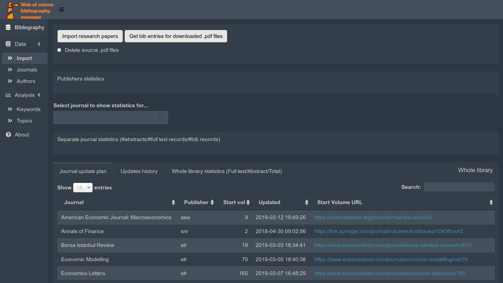
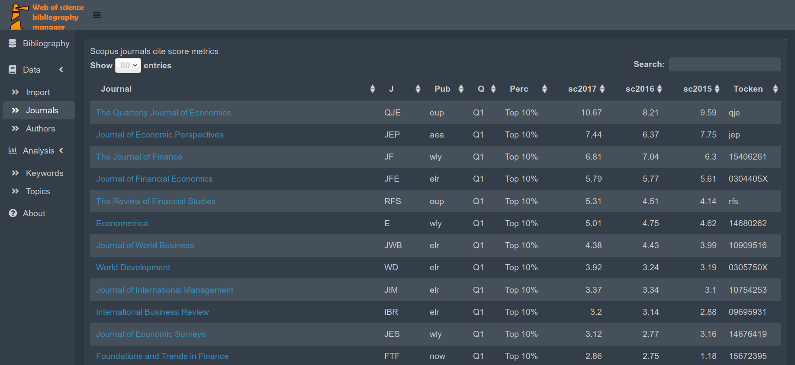
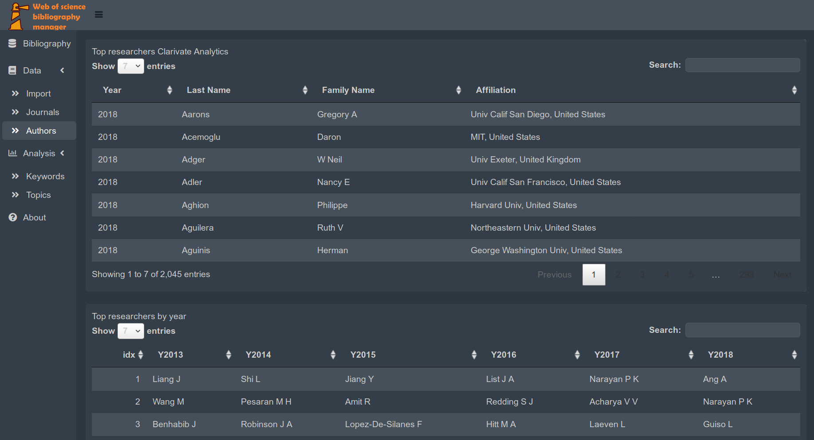
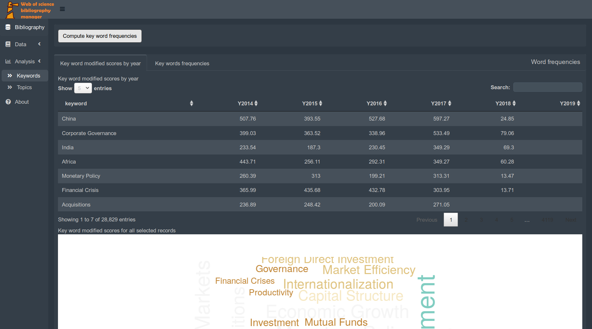
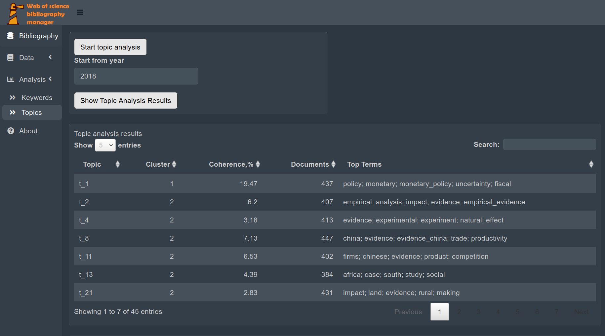
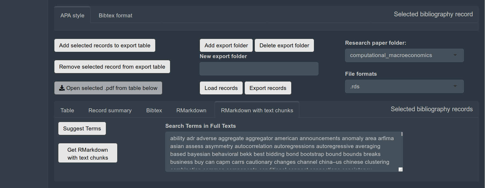

# wos
Scientific bibliography manager. 

This shiny application allows to import, organize, manage and export bibiliography references in .bibtex format (JabRef) and in RMarkdown reference format together with corresponding fulltexts in .pdf format. 

How to use:

```sh
cd ~/your/projects/directory
git clone git@github.com:aabor/wos.git
cd wos
docker-compose up -d
```

`docker-compose` will download docker image with all necessary libraries preinstalled.

After container is up, RStudio docker image with source code will be accessible at [http://localhost:8789/](http://localhost:8789/).

By default your work will be saved in `wos/Documents` folder, but you mount another folders as appropriate by changing `docker-compose.yml` file.

Main window with filter functionality and bibliography records table. There are various filters which can be applied on main bibliography data base.



If you place bibliography records in .bibtex format and `.pdf` files in `wos/new` folder you can import new records with associated full text files in your data base.

`wos bibliography mananger` is able to read meta data in pdf files and extract unique doi identifier for each article. Once doi is found it is easy to associate imported bibliography record with corresponding full text source. 

`wos bibliography mananger` is sophisticated enought to read hided meta data from pdf file. If doi is not found in meta data, program will try to find it on the first page of the article. If copying text is impossible than it will produce image copy of the first page, extract text from image and try to find doi. If all attemps fail .pdf file will not be imported.



You can see statistics on imported records in tab `Journal`



Statistics on individual researchers according to Clarivate Analytics data base is also present.



It is possible to compute key words frequencies on imported bibliography records and present results in wold cloud format.



We use sophisticated R libraries to perfom topic analysis on bibliography records data base.



It is also possible to extract some text chunks from full text pdf files given the key words and present results in markdown format.

